# Engineering Beyond Limits

> **Precision-built solutions tailored to your vision.**

We partner with forward-thinking companies to craft custom technology that drives growth and redefines possibilities. From blockchain ecosystems to enterprise-grade infrastructure, every line of code, every pixel, and every strategy is built with purpose — and proven in production.

### [🌐 Explore](https://desource-labs.org) · [📧 Get in Touch](mailto:hello@desource-labs.org)

---

---

## Our Craft

**50+ projects** across Web3, AI, and decentralized infrastructure.  
**10+ blockchain networks** integrated and optimized.  
**14+ engineers, designers, and strategists** with deep expertise.

We merge deep technical expertise with design precision, delivering systems that inspire. Trusted by innovative teams building the future.

---

| Projects | Blockchains | Team Members |
|----------|-------------|--------------|
| **50+** | **10+** | **14+** |
| Delivered & Live | Networks Integrated | Experts |

---

## What We Do

### AI-based Solutions
MCP development, AI integrations, custom solutions that leverage cutting-edge models and protocols.

### Blockchain Ecosystems
Smart contracts, dApps, DEXes, cross-chain integrations. Building the infrastructure that powers tomorrow's decentralized web.

### Back-End Architecture
High-performance systems built with Rust and Node.js. Scalable, resilient, production-ready.

### Modern Interfaces
Intuitive, pixel-perfect designs, built with top-notch frontend. Every interaction matters.

### Scalable Infrastructure
DevOps workflows that evolve with your business. From prototype to billions in transactions.

---

```mermaid
graph LR
    A(🤖 AI Solutions) --> F(Your Vision)
    B(⛓️ Blockchain) --> F
    C(⚙️ Backend) --> F
    D(🎨 Design) --> F
    E(🚀 Infrastructure) --> F
    
    style F fill:#9333ea,stroke:#a78bfa,stroke-width:3px,color:#fff
    style A fill:#1a1a1a,stroke:#666,stroke-width:2px,color:#fff
    style B fill:#1a1a1a,stroke:#666,stroke-width:2px,color:#fff
    style C fill:#1a1a1a,stroke:#666,stroke-width:2px,color:#fff
    style D fill:#1a1a1a,stroke:#666,stroke-width:2px,color:#fff
    style E fill:#1a1a1a,stroke:#666,stroke-width:2px,color:#fff
```

**Every Layer, Every Detail**

---

## Our Tech Stack

### Front-end

<table>
<tr>
<td align="center" width="96">

 TypeScript
</td>
<td align="center" width="96">

 JavaScript
</td>
<td align="center" width="96">

 Vue.js
</td>
<td align="center" width="96">

 Nuxt
</td>
<td align="center" width="96">

 React
</td>
</tr>
</table>

### Blockchain & Back-end

<table>
<tr>
<td align="center" width="96">

 Rust
</td>
<td align="center" width="96">

 Node.js
</td>
<td align="center" width="96">

 Solana
</td>
<td align="center" width="96">

 Ethereum
</td>
<td align="center" width="96">

 TON
</td>
<td align="center" width="96">

 Polkadot
</td>
<td align="center" width="96">

 Sui
</td>
</tr>
</table>

### Infrastructure & DevOps

<table>
<tr>
<td align="center" width="96">

 Docker
</td>
<td align="center" width="96">

 Kubernetes
</td>
<td align="center" width="96">

 GitHub
</td>
<td align="center" width="96">

 Vercel
</td>
<td align="center" width="96">

 AWS
</td>
</tr>
</table>

---

**Full-stack architecture built for scale**

---

## The Team

A collective of **14+ engineers, designers, and strategists** with deep expertise across blockchain, AI, and modern web architecture.

We've built production systems for ambitious projects — from NFT marketplaces to voice AI launchpads to cross-chain infrastructure. Every project benefits from our collective experience, paired with an **obsessive attention to detail** that defines our work.

---

## How We Engage

**Discovery & Planning**  
We understand your vision, timeline, and constraints. Clear communication from day one.

**Iterative Development**  
Regular checkpoints, transparent progress, and flexibility to adapt as opportunities emerge.

**Production Ready**  
Deployment, monitoring, and ongoing optimization. Your success is our success.

---

## Our Expertise

- **Custom Software Development** — Full-stack, from architecture to deployment
- **Blockchain Integration** — Smart contracts, tokenomics, cross-chain solutions
- **AI & MCP Development** — Model integration, agent design, prompt engineering
- **Design & UX** — Brand identity, interfaces, user experience optimization
- **Infrastructure & DevOps** — Scalable systems, security, performance tuning

---

## Engagement Models

We work with organizations of all sizes—from seed-stage startups to established platforms. Our engagement models are flexible:

- **Project-based** — Fixed scope, clear deliverables
- **Time & materials** — Flexible scope, ongoing support
- **Retainer** — Dedicated team, continuous optimization

**Get in touch for a conversation about your vision.**

---

## Get Started

📧 **Email:** [hello@desource-labs.org](mailto:hello@desource-labs.org)  
🔗 **GitHub:** [@DeSource-Labs](https://github.com/DeSource-Labs)  
💼 **LinkedIn:** [DeSource Labs](https://www.linkedin.com/company/desource-labs)  
💬 **Telegram:** [@desource_labs](https://t.me/desource_labs)  

**[Schedule a call](https://calendly.com/hello-desource-labs/30min)** — We respond under 24h. NDA on request.

---

### Ready to build something exceptional?

**We merge deep technical expertise with design precision, delivering systems that inspire.**

[Let's Talk](https://calendly.com/hello-desource-labs/30min)

---

**DeSource Labs** — Precision engineering for tomorrow's builders.

